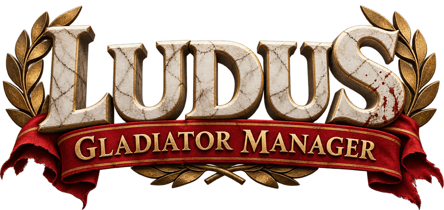
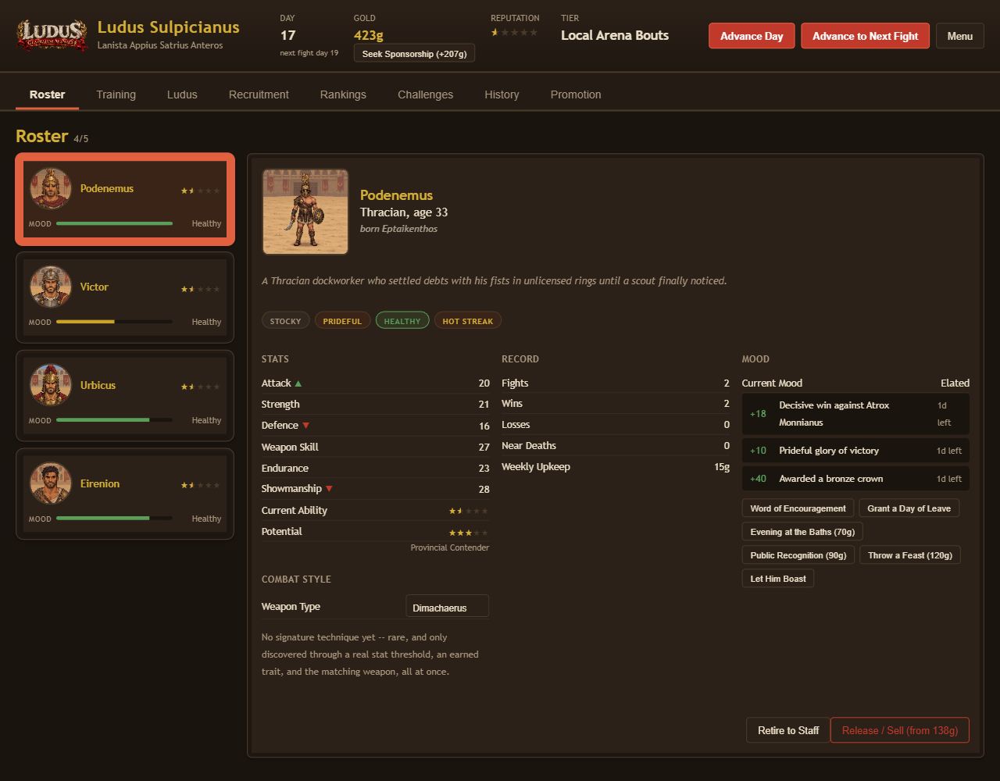
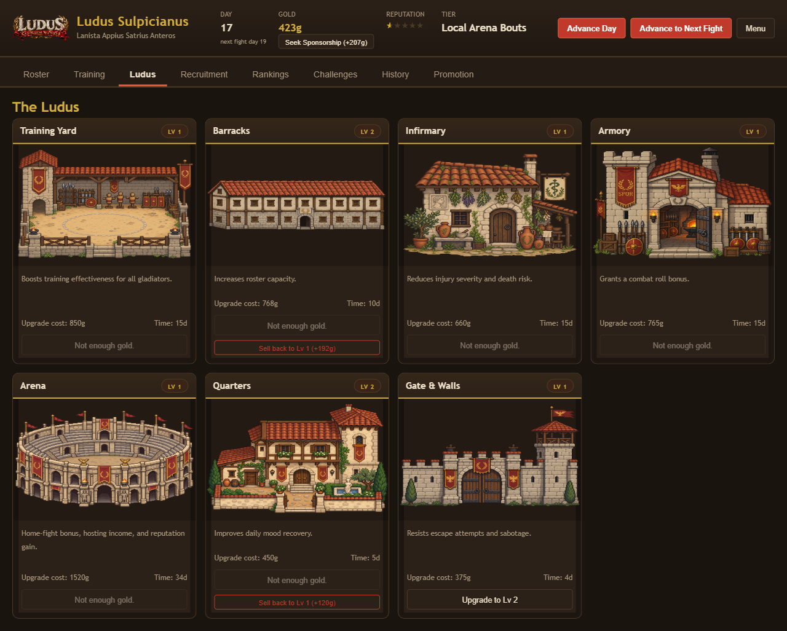
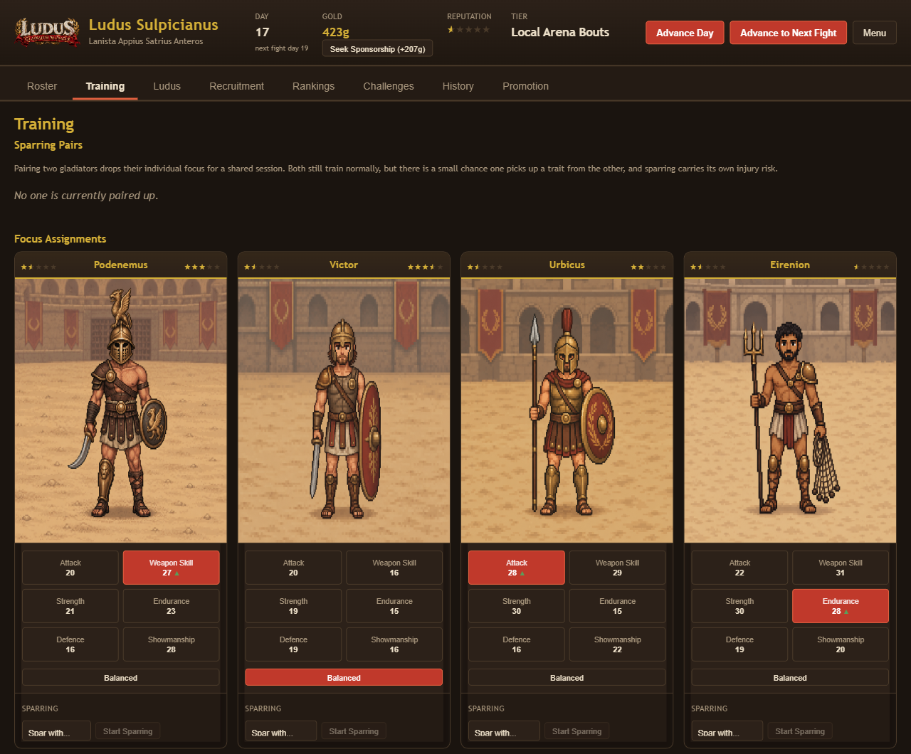

<p align="center">
  
</p>

<p align="center">
  <a href="https://corybaxtaru.github.io/gladiator-manager/"><strong>▶ Play Now</strong></a>
  — runs in your browser, saves to localStorage, no account needed.
</p>

You run a gladiator school. Buy or recruit fighters, train them, keep an eye on
their mood and health, and send them out to fight for money and reputation. Do
well enough and you get invited to tougher tiers, all the way up to the
Colosseum. Do badly and people die, escape, or get poached by a rival
school — permanently, there's no undo.

It's a single-player management sim, closer to Football Manager than anything
else, just with swords instead of transfer windows. One save, one story: every
gladiator who dies or walks out is gone for good, and every school you build
either climbs to legend or falls apart on its own.

## What's actually in it

**Four tiers, and promotion isn't automatic.** Local Arena Bouts → Provincial
Games → Rival Ludus Challengers → the Colosseum. Reputation gets you to the
door, but you also need a roster and buildings that are actually ready for the
next tier, and then you have to win a real fight against a champion from that
tier before it unlocks. You pick when to attempt it, not the game.

**Fights are stat-vs-stat, not dice rolls.** Each match is five clashes —
Attack, Weapon Skill, Endurance, Showmanship, and an overall composite — with
some random swing so the better fighter usually wins but not always. Defence
isn't a clash of its own, it just makes your opponent's numbers worse across
the board every round. Strength doesn't affect who wins; it affects how bad a
loss turns out and how good a win pays.

**Weapon types are a real choice, not flavor.** Murmillo, Retiarius, Thraex,
Dimachaerus, Secutor — each is a stat trade-off, and you can reassign one any
time. Land the right stat, weapon, and personality combination and a fighter
earns a permanent signature technique.

**Mood, personality, and physique aren't cosmetic.** Every fighter has a body
he was born with, a personality he earns over his career, and a mood you have
to actually manage — feasts, baths, public recognition, or let it slide and
watch him refuse to fight, pick a fight with a teammate, or bolt for the gate.
A risk tag on the roster warns you before it gets that far.

**Recruiting has real tiers that matter.** Three channels (cheap and
unpredictable, expensive and reliable, or a volunteer pool of free citizens)
crossed with three procurator qualities. A better procurator raises the floor
of what shows up, not just your odds of a lucky pull — worth the price once
your school can afford it.

**Sponsoring a dying gladiator costs something real.** The price scales with
how much gold you actually have and how many times you've already bailed that
specific fighter out — leaning on the same guy as a permanent safety net gets
expensive fast, on purpose.

**The buildings are illustrated, not just numbers on a card.** Training yard,
barracks, infirmary, armory, arena, quarters, and gate & walls each have their
own art and their own upgrade curve.

**Sitting still doesn't work.** Stay under-built or under-trained for your
current tier long enough and a rival will poach your worst-off fighter, or
demote your whole school outright if there's nobody left to take.

**A veteran doesn't have to be sold.** Retire him into your own staff as a
trainer instead — no gold changes hands, and his skill comes straight from his
own fighting record.

**Rival schools remember you.** They're persistent identities with their own
reputation and a running record against you, not regenerated each time. Beat
one badly enough and it's a real rivalry; lose to one enough and the rankings
screen will call it out.

**Debt is real but not a dead end.** Loans and unpaid upkeep compound into
genuine trouble, but bankruptcy resets you — buildings gutted, reputation
cut — instead of soft-locking the save forever.

## Screenshots

<p align="center">
  
</p>
<p align="center">
  
</p>
<p align="center">
  
</p>

## Development

React + TypeScript + Vite. No backend, no env vars, no database.

```bash
npm install
npm run dev      # local dev server
npm run build    # production build
npm run lint     # oxlint
```

The live site is a static build pushed manually to the `gh-pages` branch —
it doesn't redeploy automatically when `master` changes.
