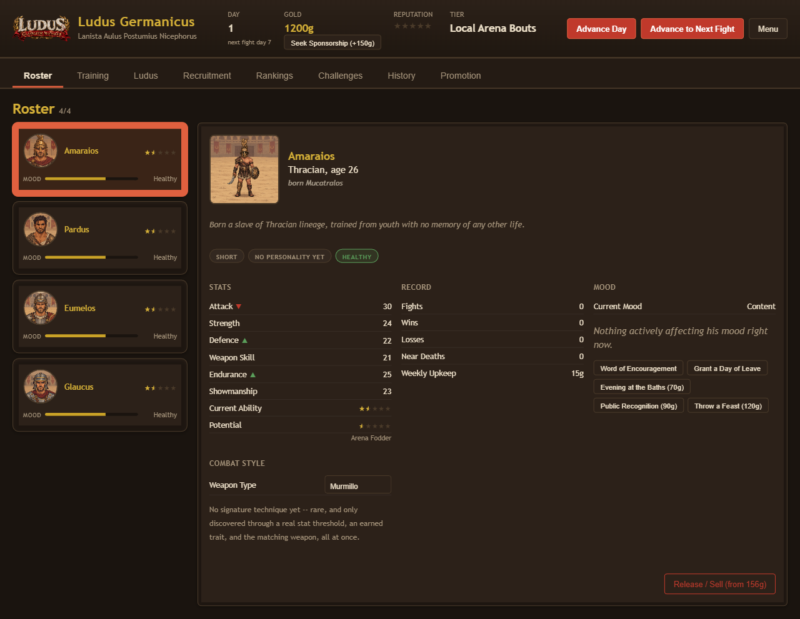
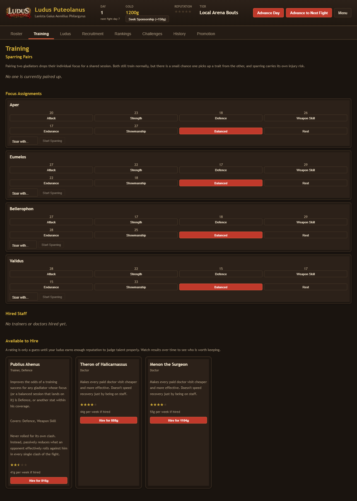

<p align="center">
  
</p>

<p align="center">
  <a href="https://corybaxtaru.github.io/gladiator-manager/"><strong>▶ Play Now</strong></a>
  &nbsp;·&nbsp; No install, no sign-up, no backend — it runs entirely in your browser and saves your progress locally.
</p>

Buy slaves and volunteers off the market, put them through a training yard, and send
them out to die for your reputation. **Ludus: Gladiator Manager** is a single-player,
browser-based management sim about running a Roman gladiatorial school — recruit and
train fighters, keep them fed, healthy, and (mostly) willing, and climb from backwater
Local Arena Bouts all the way to the Colosseum. Think *Football Manager* for the sand,
with a splash of *Grepolis*-style empire upkeep and *Europa Universalis*-flavored
consequences: bad decisions don't just cost you a fight, they can bankrupt your ludus,
get a veteran poached by a rival school, or get a gladiator killed.

There is no meta-progression outside a single save. Every gladiator who dies, escapes,
or gets poached is gone for good, and every ludus you build is its own self-contained
story from founding to (eventually) ruin or legend.

## Features

- **Four-tier career ladder** — Local Arena Bouts → Provincial Games → Rival Ludus
  Challengers → the Colosseum. Reputation alone doesn't move you up: you have to win an
  optional, player-timed **Promotion Fight** against a real champion, and pass a
  readiness check on your buildings and roster before you're even offered one.
- **Clash-based combat** — every fight is a sequence of stat-vs-stat clashes (Attack,
  Weapon Skill, Endurance, Showmanship, and a blended Overall Prowess), each with a
  bounded random swing so the better fighter usually wins but upsets stay real.
  Strength and Defence sit outside the clash sequence entirely: Defence passively
  blunts what an opponent rolls against you, and Strength raises the stakes instead of
  the odds — a powerful opponent makes losing to him worse, and your own Strength pays
  out bigger on a decisive win.
- **Weapon types & signature techniques** — reassign a gladiator's weapon
  (Murmillo, Retiarius, Thraex, Dimachaerus, Secutor) for a real stat trade-off, not
  just flavor. Push the right weapon, stat, and personality trait combination far
  enough and a fighter can earn a rare, permanent signature technique — announced by
  name the moment it fires, in an ordinary fight day or a Promotion Fight, a death
  match, an arranged match, or the Colosseum finale.
- **Mood, personality, and physical traits** — every gladiator has a body he was born
  with, a personality he earns through his career, and a mood that can be nursed with
  feasts, baths, and public recognition or left to rot into an escape attempt. A
  visible risk tag on the roster tells you when someone is drifting toward trouble
  before it happens.
- **Retirement into staff** — a veteran who's aged out or proven himself doesn't have
  to be sold. Repurpose him onto your own staff as a trainer instead, no gold changes
  hands, and his specialty and skill come from his own fighting record.
- **Persistent rival ludi** — the schools you fight against are stable identities with
  their own reputation and a running record against you, not randomly regenerated
  opponents. Beat one badly enough and it's a real, remembered rivalry; let one beat
  you enough and the Rankings screen will call it out as a Bitter Rival.
- **Ongoing tier pressure** — clearing a Promotion Fight once isn't a permanent pass.
  Coast too long on a building and roster standard well below what your current tier
  expects and a rival will poach your worst-neglected fighter, or demote your ludus
  outright if there's no one left to poach.
- **A real economic floor** — loans, sponsorships, and compounding debt can genuinely
  sink a ludus, but bankruptcy is a hard reset, not a soft-lock: it's painful (gutted
  buildings, collapsed reputation) but always survivable.
- **Recruitment, training, and staff** — three recruiting channels at three quality
  tiers, six trainable stats, sparring pairs, and a staff of trainers and doctors whose
  skill and coverage genuinely change your odds.

## Screenshots

<p align="center">
  
</p>
<p align="center">
  
</p>

## Development

A standard React + TypeScript + Vite app — no backend, no environment variables, no
database.

```bash
npm install
npm run dev      # local dev server
npm run build    # production build
npm run lint     # oxlint
```

The live site at [corybaxtaru.github.io/gladiator-manager](https://corybaxtaru.github.io/gladiator-manager/)
is a static build published manually to the `gh-pages` branch, not deployed
automatically on push.
